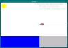
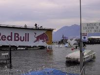
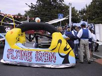
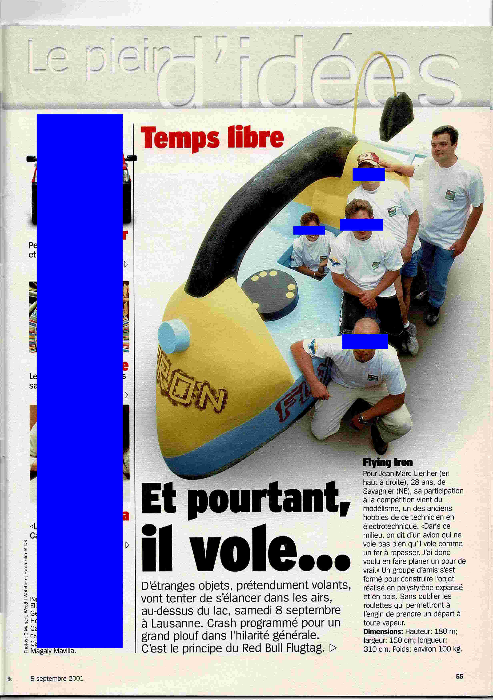

</html>
<head>
<META HTTP-EQUIV="Content-Type" CONTENT="text/html; charset=iso-8859-1">

<title>Flugtag</title>
</head>
<body background="../images/backgound.jpg" style="background-attachment: fixed">
<table border="0" cellpadding="3" cellspacing="0" width="100%" height="93%">
	<!-- MSTableType="layout" -->
	<tr>
		<td valign="top">
		<!-- MSCellType="DecArea" -->
		<!-- MSCellType="ContentHead" -->
		<table cellpadding="0" cellspacing="0">
			<!-- MSTableType="layout" -->
			<tr>
				<td align="center" width="100%">
				<h2 align="center">&nbsp;Simple software solutions for a complex 
				world</h2>
				</td>
			</tr>
		</table>
		</td>
	</tr>
	<tr>
		<td valign="top" colspan="2">
		<!-- MSCellType="NavBody" -->
		<H1>RED BULL FLUGTAG 2001.</H1>
<H2>8 SEPTEMBRE 2001, LAUSANNE-OUCHY</H2>
<A href="https://www.redbull.com/ch-fr/events/red-bull-flugtag-switzerland">www.flugtag.ch</a>

<H1><u>"FLYING IRON"</u></H1>
<H2>team Nickasil production</H2>

 
 
<blink>Téléchargez</blink> notre simulateur de vol de fer à repasser :  
<ul>
<li>version Linux (Debian 2.2) : <a href="flugtag_linux">flugtag_linux</a></li>
<li>version SGI IRIX 6.5 : <a href="flugtag_irix">flugtag_irix</a></li>
<li>version Windows NT : <a href="flugtag_nt.exe">flugtag_nt.exe</a></li>
<li>version Windows 98 : <a href="flugtag_98.exe">flugtag_98.exe</a></li>
 
<li>code source : <a href="flugtag.tgz">flugtag.tgz</a></li>
</ul>
  
 
  

		

 
		</td>
	</tr>
</table>

&nbsp;

 

Copyright (c) 2001 
Jean-Marc Lienher

</body>
</html>
